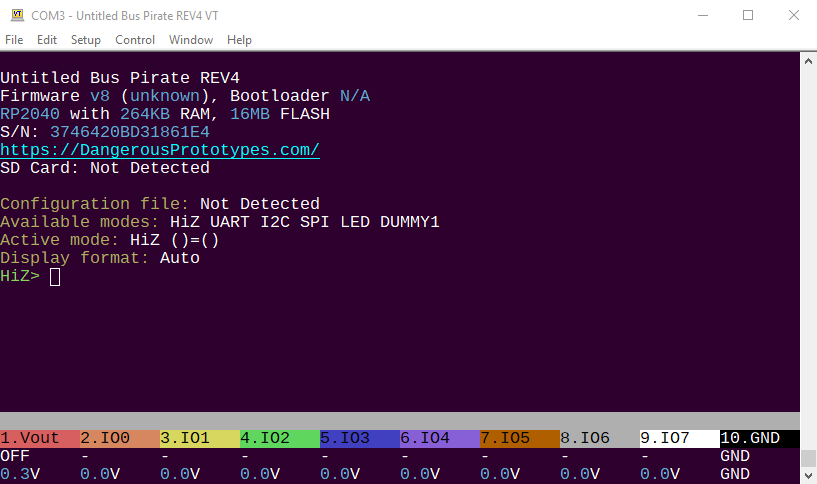

# Bus Pirate 5


Bus Pirate 5 is the latest edition of the universal serial interface trusted by hackers since 2008.

Can't get a chip to work? Is it the circuit, code, bad part or a burned out pin? The Bus Pirate sends commands over common serial protocols (1-Wire, I2C, SPI, UART, MIDI, serial LEDs, etc) so you can get to know a chip before prototyping. Updated with tons of new features, talking to chips and probing interfaces is more fun than ever!

## Resources

- [Download the latest firmware build](https://forum.buspirate.com/t/bus-pirate-5-auto-build-main-branch/20/99999)
- [Get help and chat in the forum](https://forum.buspirate.com/)
- [Firmware documentation](https://firmware.buspirate.com/) ([source](https://github.com/DangerousPrototypes/BusPirate5-docs-firmware))
- [Hardware documentation](https://hardware.buspirate.com/) ([source](https://github.com/DangerousPrototypes/BusPirate5-docs-hardware))
- [Hardware repo](https://github.com/DangerousPrototypes/BusPirate5-hardware)
- [Firmware repo](https://github.com/DangerousPrototypes/BusPirate5-firmware)

## VT100 terminal interface



VT100 terminal emulation supports color and a live statusbar view of the voltage and functions on each pin. Type simple commands into the terminal, the Bus Pirate translates them into popular serial protocols and displays the response. Learn how a chip works without touching a line of code.

## Specifications

- Raspberry Pi RP2040 with 128Mbit program flash
- 8 powerful IO pins - Support multiple protocols from 1.2-5volts. Analog voltage measurement and optional 10K pull-ups on all pins
- 1-5volt output power supply - 0-500mA current limit, current sense, resettable fuse and protection circuit
- 1Gbit NAND flash - Store settings and files. Appears as a USB drive.
- LCD - A beautiful 240x320 pixel color IPS (all angle viewing) LCD acts as a pin label, while also showing the voltage on each pin and the current consumption of the programmable power supply unit
- 18 RGB LEDs - It's customary to have an indicator LED, so to check that box we added 18 SK6812 RGB LEDs.
- Just one button - 18 party LEDs but just one button!
- 1-Wire, I2C, SPI, UART, MIDI, serial LEDs supported, more to come!

Bus Pirate 5 is the universal serial interface tool designed by hackers, for hackers. It's crammed full of hardware and firmware features to make probing chips pleasant and easy.  

## Build

This project uses `cmake` as the build system, so building the project only takes 2 steps:
1. project configuration (needs to be ran once, or when you want to change configuration).  
    ```
    cmake -S . -B build_rp2040 -DPICO_SDK_FETCH_FROM_GIT=TRUE
    cmake -S . -B build_rp2350 -DPICO_SDK_FETCH_FROM_GIT=TRUE -DBP_PICO_PLATFORM=rp2350
    ```
    you may want to add the flags `-DPICO_SDK_PATH=/path/to/pico-sdk -DPICO_SDK_FETCH_FROM_GIT=FALSE` if you want to use pico-sdk that is in your local path.  
    > NOTE: WINDOWS users: for some reason the automatic fetch fails because of git submodule, so you will need to clone pico-sdk your self, and then
    > apply the following commands inside the pico-sdk repo:  
    > ```bash
    > git submodule init
    > git submodule update
    > ```
    
2. project build
    ```bash
    cmake --build ./build_rp2040 --target all
    cmake --build ./build_rp2350 --target all
    # you may add a specific target, such as:
    cmake --build ./build_rp2040 --target bus_pirate5_rev8
    cmake --build ./build_rp2040 --target bus_pirate5_rev10
    cmake --build ./build_rp2350 --target bus_pirate5_xl
    cmake --build ./build_rp2350 --target bus_pirate6
    ```
    You can also manually clean using `--target clean`, or
    force a clean prior to building by using `--clean-first`.

### Build using Github Actions

Having difficulty setting up a build environment?  Here's a
workaround that, while it takes longer to build than a local build,
can be done with just a web browser and a GitHub account.

<details><summary>Click to expand / show workaround...</summary><P/>

Example:
1. Presume you've forked the repository into your GitHub account, and have a local branch you've named `fix_branch` with your changes.
1. Next, click on the `Actions` tab (near top of the UI, to the right of `<> Code` and `Pull Requests`
1. If this is the first time you've done this, you may need to authorize the github actions to run on your fork.  This is a one-time operation.
1. Otherwise, click on the `CMake` workflow listed on the left.
1. Note that the page will say, `This workflow has a workflow_run event trigger.`  That means you can run the action manually on a branch of your choice.
1. Click the `Run workflow` button, select the branch you created (e.g., `fix_branch`), and click the `Run workflow` button.
1. Wait a few seconds, then refresh the page, and you should see the workflow running.  It may take a few minutes to complete (e.g., **4-7 minutes** is normal.)
1. Once the workflow completes (shows green checkmark), click on the job to see details.  At the bottom of the page should be the generated artifacts, with download links.
1. Download the artifact of interest. BP5 firmware can be found in `firmware-rp2040-*`, while the BP5XL and BP6 firmwares can be found in `firmware-rp2350-*`.

That's it!  You now have a firmware build without having to have installed a local build environment.

</details>

### build using docker

Instructions on the forum provide additional details; however, this repo provides a docker compose image for you to just get running quickly in the event you want to try patching/hacking.
To run a build, perform the following actions on linux:

```sh
# clone the repo
git clone git@github.com:DangerousPrototypes/BusPirate5-firmware.git
cd BusPirate5-firmware

# OPTIONAL: build the environment, or you can just let it pull - this will happen automatically in vscode using the devcontainers
# docker compose build
#
# NOTE: should you need to customize your users in docker for some reason:
# docker compose build --build-arg UID="$(id -u)" --build-arg GID="$(id -g)" --build-arg USERNAME="build" dev

# run a build
docker compose run dev build-clean

# build stuff happens ...
# [100%] Linking CXX executable bus_pirate5_rev10.elf
# Memory region         Used Size  Region Size  %age Used
#            FLASH:      460068 B         2 MB     21.94%
#              RAM:      256168 B       256 KB     97.72%
#        SCRATCH_X:          4 KB         4 KB    100.00%
#        SCRATCH_Y:          0 GB         4 KB      0.00%
# [100%] Built target bus_pirate5_rev10
#
# your build will be placed in ./build/ - congrats!

# Or drop into the container and run builds manually
docker compose run dev

# To debug using the containers
cp docker/debug.env .env
# edit your BP_PORT{#} environment variables to your USB devices
# run the debug version of the services
docker compose run dev-debug
```

### Building without LGPL3 protected component
**NOTE** by doing the following you may not need to distribute the binaries under LGPL3 license terms. 

To compile the firmware without LGPL3 components, simply add the following flags to the configuration step above:  
`-DUSE_LGPL3=NO -DLEGACY_ANSI_COLOURS_ENABLED=NO`

## Other open source licenses

This project uses code from the following licenses:  
* LGPL3  
* BSD 3 clause 

More information on the licenses and components being used can be found [here](docs/licenses.md).  

## Contributing
Please see [contributing.md](docs/contributing.md)


